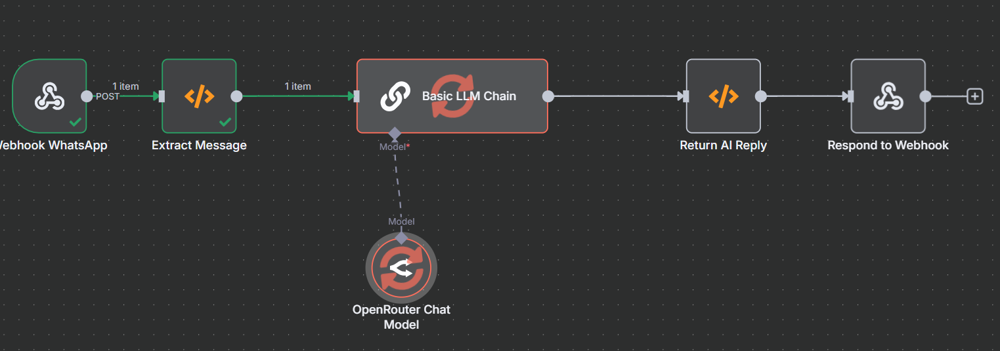

# 💬 WhatsApp AI Companion with n8n + OpenRouter

This project is a lightweight conversational AI agent built in [n8n](https://n8n.io/), powered by [OpenRouter's](https://openrouter.ai/) Gemini 2.5 Pro model.  
It receives WhatsApp messages via webhook, processes them with an AI model, and responds in real-time.

> 🔧 Ideal for building WhatsApp bots, virtual companions, or basic assistants without writing a backend server.

---

## 🧠 What It Does

- ✅ Accepts **incoming WhatsApp messages** (via POST request)
- 🧠 Extracts the message content and sender
- 🗣 Uses **Gemini 2.5 Pro (via OpenRouter)** to generate responses
- 🔁 Sends the AI-generated message back through the webhook

---

## 🖼 Workflow Preview

---

## 🔄 Step-by-Step Workflow

1. **Webhook Node (`/webhook/whatsapp`)**
   - Receives POST request from your WhatsApp provider (like Meta, Twilio, or Baileys)
   - Payload contains message content (`body`) and sender info (`from`)

2. **Extract Message**
   - A function node that pulls out:
     - `message.body`
     - `message.from`

3. **Basic LLM Chain**
   - Uses a predefined instruction: `"You are a helpful AI companion"`
   - Sends message text to Gemini 2.5 via the next node

4. **OpenRouter Chat Model**
   - Gemini 2.5 Pro (via OpenRouter)
   - Processes and replies with conversational text

5. **Return AI Reply**
   - Captures AI output and formats it into a response object

6. **Respond to Webhook**
   - Sends the response back to your WhatsApp bridge (or direct client)

---

